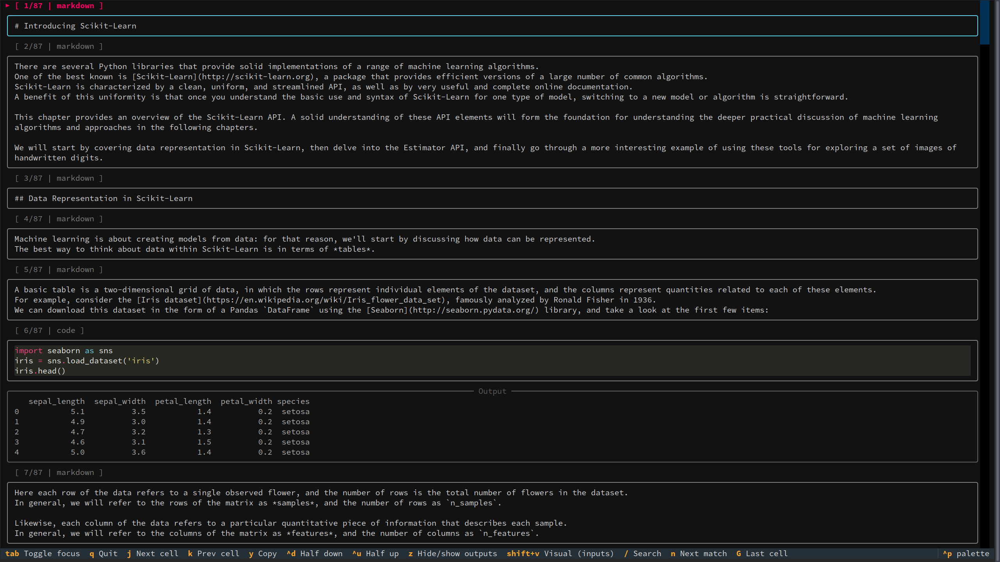

nbsee
=====

Simple CLI viewer for Jupyter notebooks focused on fast reading and easy copying of code and text outputs from the terminal.



Goals (MVP)
- Interactive terminal viewer for `.ipynb`.
- Navigate cells with keys; focus input vs output.
- Code cells: show source and text/plain outputs only.
- Easy copying from the viewer using the keyboard (xclip).
- Ignore images/HTML-rich outputs for now.

Usage
- `nbsee notebook.ipynb` — open an interactive viewer.

Key bindings
- `j`/`k`: move to next/previous cell
- Arrow Up/Down: scroll the view line-by-line
- PageUp/PageDown: page scroll
- Ctrl+u / Ctrl+d: half-page scroll up/down
- `Tab`: toggle focus between input (code/markdown) and output (text/plain)
- If a cell has no text output, `Tab` does nothing and shows a brief message.
- `y`: copy the currently focused region to clipboard using `xclip -selection clipboard`
- `z`: hide/show all outputs (fold outputs)
- `Shift+V`: start/stop visual selection for inputs; use `j`/`k` to expand/shrink; `y` copies all selected code cells
- `/`: search (inputs+outputs). Enter to submit, `Esc` cancels
- `n` / `N`: next/prev match
- `gg` / `G`: jump to first / last cell
- `q`: quit

Notes
- Copying uses Linux X11 clipboard via `xclip`. Wayland/macOS not targeted in MVP.
- When an output is not available (e.g., no text/plain), copy will show an inline message.
- Python syntax highlighting is built-in via Rich.

Install

**uv (recommended)**

[uv](https://docs.astral.sh/uv/) is a fast Python package manager. Install it from [here](https://docs.astral.sh/uv/getting-started/installation/).

```bash
# Run without installing
uvx nbsee notebook.ipynb

# Or install permanently
uv tool install nbsee
```

**pip**
```bash
pip install nbsee
```

After installing, run:
```bash
nbsee notebook.ipynb
```

Development (uv)
- Quick run without installing: `uv run -m nbsee path/to/notebook.ipynb`
- Run tests: `uv run pytest`
- Lint/format check: `uv run ruff check .` and `uv run ruff format --check .`
- Build distributions: `uv build`
- Release: push a tag like `v0.1.0` to trigger `.github/workflows/publish.yml` (requires PyPI trusted publishing setup).
- Install editable and use `nbsee` command:
  - Create venv: `uv venv`
  - Activate: `source .venv/bin/activate`
  - Install: `uv pip install -e .`
  - Run: `nbsee path/to/notebook.ipynb`
- Clipboard requirement: `xclip` on Linux/X11 must be installed and available in `PATH`.


Docs
- Design: `docs/DESIGN.md`
- TODOs & roadmap: `docs/TODO.md`
